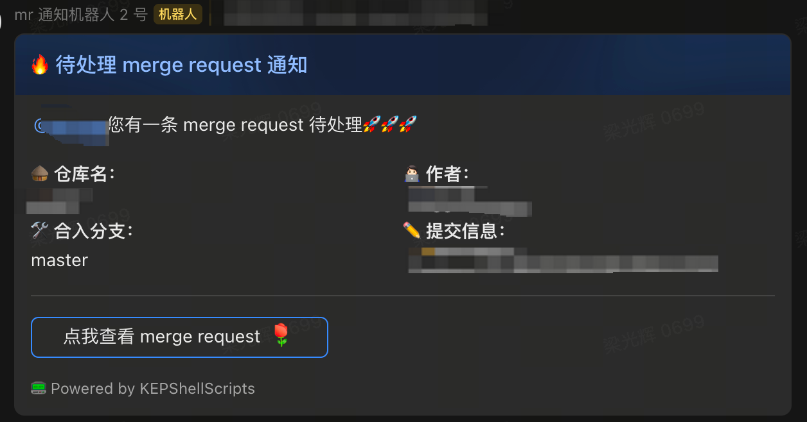
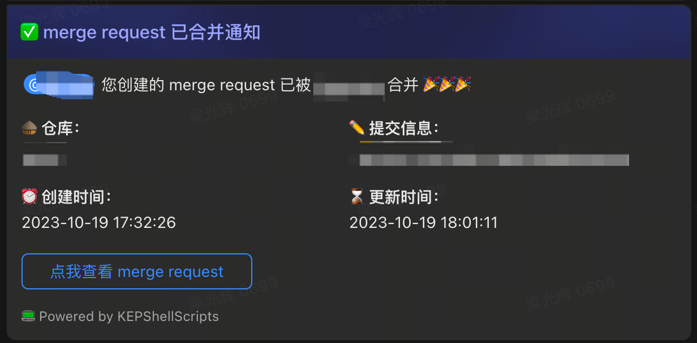
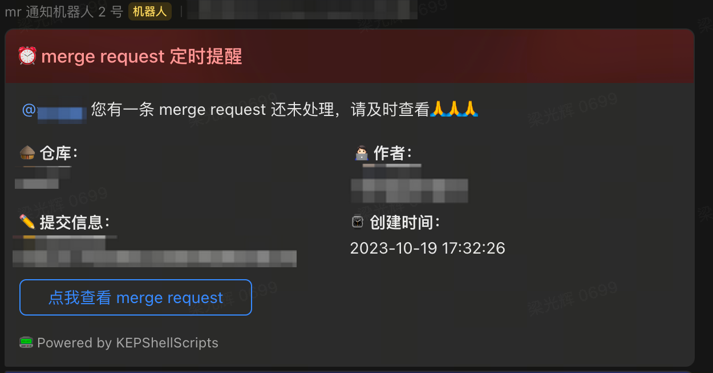
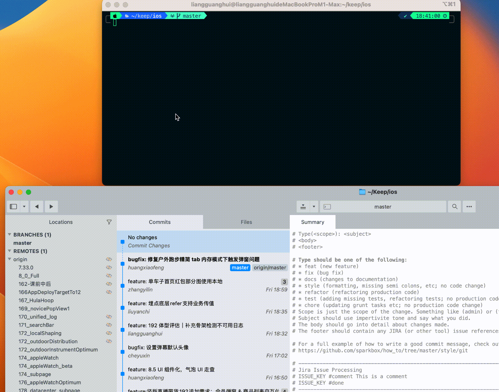

# ShellScripts

[👉 createMR](https://gitlab.com/Lguanghui/ShellScripts/-/blob/master/README.md#createmr-%E8%84%9A%E6%9C%AC)

[👉 mergeRequest](https://gitlab.com/Lguanghui/ShellScripts#mergerequest-%E8%84%9A%E6%9C%AC)

[👉 Xcode 相关脚本](#xcode)

`createMR.sh` 是功能比较完善的脚本，内部使用 python 语言，支持处理 Podfile 的改动，建议作为主力使用。

`mergeRequest.sh` 是快速创建 merge request 的脚本，内部使用 Shell 语言。不会处理 Podfile 的改动，但速度比较快，建议仅在组件库内生成 merge request 时使用

## Features

- [x] 一键创建 merge request
- [x] 根据 Podfile 改动，在 merge request 中携带相应组件库的 merge request 或者 commit
- [x] 创建 merge request 之后，向飞书群发送提醒消息
- [x] merge request 合并后，向飞书群发送提醒消息
- [x] merge request 超时未合并，定时向飞书群发送提醒消息







## createMR 脚本

> **⚠️ 需要 python 版本 >= 3.10**
> 
> 推荐使用 brew 安装和管理 python: `brew install python` `brew upgrade`(完成后重启终端)
>
> 使用时如出现 SSL 等相关错误，请关闭 Charles 等代理软件对电脑端的代理（对手机端代理无影响）

### 添加终端环境变量

将 createMR.py 所在文件夹添加到终端配置中（例如 .zshrc）：

```shell
export PATH="$PATH:/Users/liangguanghui/IdeaProjects/ShellScripts/GitShells"
```

### 初始化配置

#### 运行初始化指令

```shell
createMR.sh --init
# 如果遇到 zsh: permission denied: ./createMR.sh 错误。需要执行：sudo chmod 777 createMR.sh
```

#### 填写配置文件

上面运行初始化配置指令后，都会在当前目录下生成一个 `MRConfig.ini` 以及一个 `config.json` 文件。这两个配置文件应该和脚本/可执行文件在同一个文件夹下。

在 `MRConfig.ini` 文件中**需要将配置文件中的 token 替换为自己在 gitlab 生成的 token**。


如果需要发送飞书机器人消息的话，还需要在 `config.json` 文件中配置机器人 webhook 地址、被@用户的飞书 ID。获取飞书用户 ID 的方法参见 https://www.cnblogs.com/mxcl/p/16359730.html，并设置 `send_feishubot_message` 为 yes

### 生成 merge request

运行指令：

```shell
createMR.sh
```

样图：


脚本流程与下面的 mergeRequest.sh 相似。

### 懒人模式

懒人模式下，脚本会自动检索 Podfile 中可以更新 commit 的组件库。

如果某个组件库主分支最近一次的提交在 7 天内，且这个提交的 hash 并不是 Podfile 中使用的 hash，那么这个组件库会被列入候选列表中。

脚本使用者可以在候选列表中选择自己想要更新的组件库。

组件库确认后，脚本会将 Podfile 中这些组件库的 commit hash 更新为最新提交的 hash。并自动提交 Podfile 改动。

提交改动时，使用者可以在组件库最新提交的 message 中选择一个作为本次改动提交的 message，当然也可以自己编写 message。



### 脚本参数

1. **--init** 初始化配置
2. **--debug** 开启 debug 模式
3. **--fast** 强制使用 mergeRequest.sh 脚本。能够快速创建 merge request，但是不处理 Podfile
4. **--lazy** 懒人模式。自动检索可以更新 commit 的组件库，并自动修改 Podfile。

## mergeRequest 脚本

### 使用方法

#### 方式一：普通终端使用

1. 把脚本路径加到终端配置里面

```shell
# Merge Request Shell Script
export PATH="$PATH:/Users/liangguanghui/IdeaProjects/ShellScripts/GitShells"
```

2. 在要创建 MR 的仓库目录下，使用下面指令创建 MR

```shell
mergeRequest.sh
```


#### 方式二：Sublime Merge 指令面板调用

1. 添加 git alias

```shell
[alias]
	createmergerequest = "!bash /Users/liangguanghui/IdeaProjects/ShellScripts/GitShells/mergeRequest.sh"
```

2. 添加 Sublime Merge 自定义指令

```json
[
    {
        "caption": "Create Merge Request",
        "command": "git",
        "args":
        {
            "argv":
            [
                "createmergerequest",
                "-p",
                "/Users/liangguanghui/IdeaProjects/ShellScripts",
                "-b",
                "$select_remote_branch",
                "-m",
                "$text"
            ]
        }
    }
]
```

3. 在指令面板调用上面新加的指令，获取 MR 链接


### 脚本流程

1. 检查是否有未提交的改动。如果有，终止脚本
2. 要求输入目标分支。默认是 master，可以直接回车
3. 要求输入 MR 标题。默认是最近一次提交的信息，可以直接回车
4. 获取当前分支（源分支）
5. 从当前分支上创建并切换到一个缓存分支
6. 将缓存分支 push 到 remote。push 的时候携带了创建 MR 需要的一些信息
7. 将分支切回本地的源分支，并删掉缓存分支
8. 输出 MR 链接

## Xcode

<span id="xcode">Xcode 相关的脚本</span>

### update_all_module_minimum_target

一键修改 Gitlab 所有 iOS 仓库（包含主工程和组件库）支持的最低系统版本：

- 修改 Podfile 中的 `platform :ios, xx.x`
- 修改 podspec 文件中的 `ios.deployment_target`
- 修改 xcodeproj 文件夹中 pbxproj 类型的文件，正则匹配 `IPHONEOS_DEPLOYMENT_TARGET`

所有修改在线上进行，不需要本地 clone 仓库。默认在子分支进行修改，修改完成后生成并打印 merge request 链接。