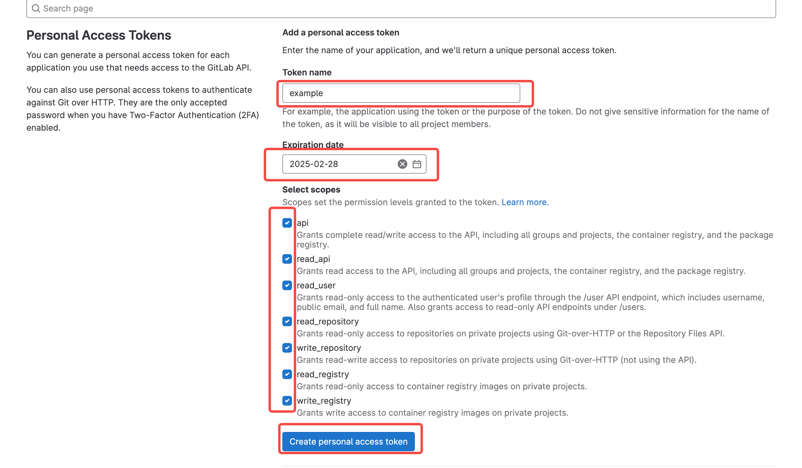
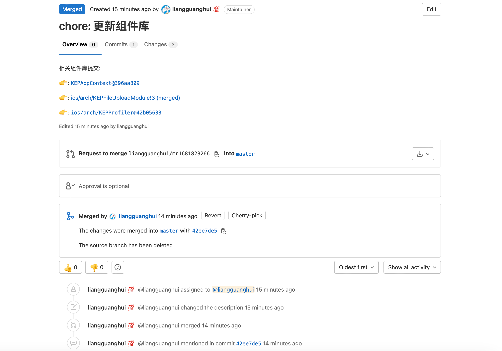
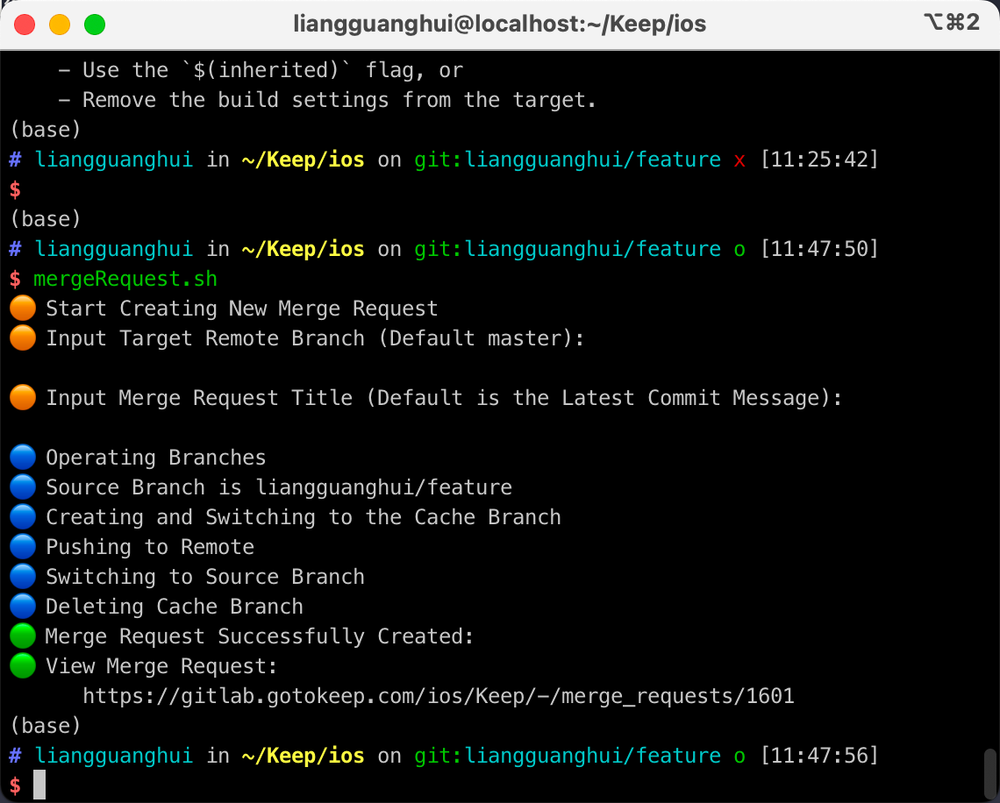
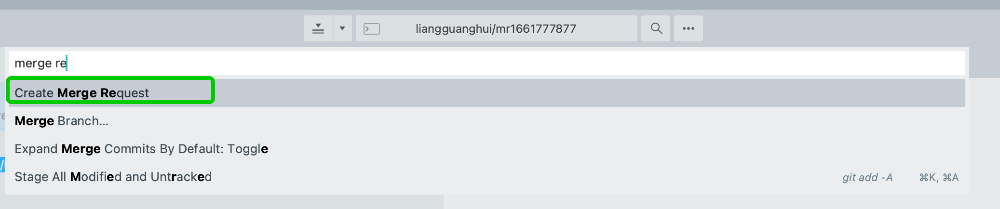
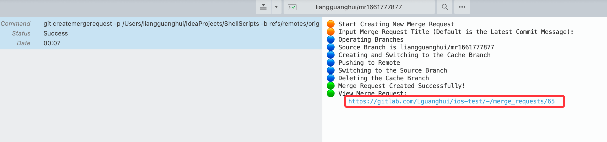

# ShellScripts

[👉 createMR](https://gitlab.com/Lguanghui/ShellScripts/-/blob/master/README.md#createmr-%E8%84%9A%E6%9C%AC)

[👉 mergeRequest](https://gitlab.com/Lguanghui/ShellScripts#mergerequest-%E8%84%9A%E6%9C%AC)

## createMR 脚本

> 需要 python 版本 >= 3.10
> 
> 推荐使用 brew 安装和管理 python: `brew install python` `brew upgrade`

### 初始化配置

#### 方式一：通过可执行文件运行 (不推荐，执行速度比较慢)

将 GitShells/dist/createMR 可执行文件下载放置到某个路径下（自定义）。

> 建议将可执行文件所在文件夹添加到终端配置中（例如 .zshrc）：
> 
> `export PATH="$PATH:/Users/liangguanghui/IdeaProjects/ShellScripts/GitShells/dist"`

终端执行：

```shell
createMR --init
```

#### 方式二：直接运行脚本

方式二和方式三需要安装 package：

```shell
pip3 install python-gitlab
pip3 install gitpython
```

> 建议将 createMR.py 所在文件夹添加到终端配置中（例如 .zshrc）：
> 
> `export PATH="$PATH:/Users/liangguanghui/IdeaProjects/ShellScripts/GitShells"`

```shell
python createMR.py --init
```

#### 方式三：运行 shell 脚本（推荐）

> 将 createMR.sh 及 createMR.py 所在文件夹添加到终端配置中（例如 .zshrc）：
> 
> `export PATH="$PATH:/Users/liangguanghui/IdeaProjects/ShellScripts/GitShells"`

```shell
createMR.sh --init
# 如果遇到 zsh: permission denied: ./createMR.sh 错误。需要执行：sudo chmod 777 createMR.sh
```

上面几种方式运行初始化配置指令后，都会在当前目录下生成一个 `MRConfig.ini` 文件。**需要将配置文件中的 token 替换为自己在 gitlab 生成的 token**。



### 生成 merge request

和生成配置类似，生成 merge request 也有相应的两种方式，只不过需要把 `--init` 参数去掉。例如：

```shell
createMR                # 方式一
python3 createMR.py     # 方式二
createMR.sh             # 方式三
```

样图：



脚本流程与下面的 mergeRequest.sh 相似。

## mergeRequest 脚本

### 使用方法

#### 方式一：普通终端使用

1. 把脚本路径加到终端配置里面

```shell
# Merge Request Shell Script
export PATH="$PATH:/Users/liangguanghui/IdeaProjects/ShellScripts/GitShells"
```

2. 在要创建 MR 的仓库目录下，使用下面指令创建 MR

```shell
mergeRequest.sh
```


#### 方式二：Sublime Merge 指令面板调用

1. 添加 git alias

```shell
[alias]
	createmergerequest = "!bash /Users/liangguanghui/IdeaProjects/ShellScripts/GitShells/mergeRequest.sh"
```

2. 添加 Sublime Merge 自定义指令

```json
[
    {
        "caption": "Create Merge Request",
        "command": "git",
        "args":
        {
            "argv":
            [
                "createmergerequest",
                "-p",
                "/Users/liangguanghui/IdeaProjects/ShellScripts",
                "-b",
                "$select_remote_branch",
                "-m",
                "$text"
            ]
        }
    }
]
```

3. 在指令面板调用上面新加的指令，获取 MR 链接






### 脚本流程

1. 检查是否有未提交的改动。如果有，终止脚本
2. 要求输入目标分支。默认是 master，可以直接回车
3. 要求输入 MR 标题。默认是最近一次提交的信息，可以直接回车
4. 获取当前分支（源分支）
5. 从当前分支上创建并切换到一个缓存分支
6. 将缓存分支 push 到 remote。push 的时候携带了创建 MR 需要的一些信息
7. 将分支切回本地的源分支，并删掉缓存分支
8. 输出 MR 链接
